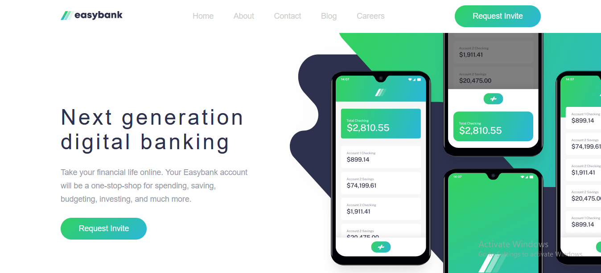

# Frontend Mentor - Easybank landing page

This is a solution to the [ Huddle landing page with curved sections](https://www.frontendmentor.io/challenges/Easybank landing page). Frontend Mentor challenges help you improve your coding skills by building realistic projects. 

## Table of contents

- [Overview](#overview)
  - [The challenge](#the-challenge)
  - [Screenshot](#screenshot)
  - [Links](#links)
- [My process](#my-process)
  - [Built with](#built-with)
  - [What I learned](#what-i-learned)
  - [Useful resources](#useful-resources)
- [Author](#author)
- [Acknowledgments](#acknowledgments)

## Overview

### The challenge

Users should be able to:

- View the optimal layout for the section depending on their device's screen size

### Screenshot

### Links

- Solution URL: 
- Live Site URL: 

## My process

- This project is comprised of five sections;
 1. Page-one
 2. Page-two
 3. Page-three
 5. footer
 - I started off by breaking down the required components for each page.
 - Setting up the tools needed for the project followed.
 - In each section, I made use of custom names to best describe the type of content found in each container. eg(flex-container, grid-container).
- Mobile-first workflow.

### Built with

- Semantic HTML5 markup
- CSS custom properties
- Flexbox
- CSS Grid

### What I learned

On the first grid-container, settting up the phone icon and respective background was a challenge. But with help from (https://www.stackoverflow.com) and (https://w3school.com). Secondly I left out the mobile drop down menu, due to not fully undertanding the process of setting it up. Any feedback how to go about this is much appreciated. 

### Useful resources

-  - This helped me to understand fully how position absolute works. I really liked this pattern and will use it going forward.

## Author

- Frontend Mentor - [@Mosestule2003](https://www.frontendmentor.io/profile/Mosestule2003)
- Twitter - [@mosestule](https://www.twitter.com/yourusername)
